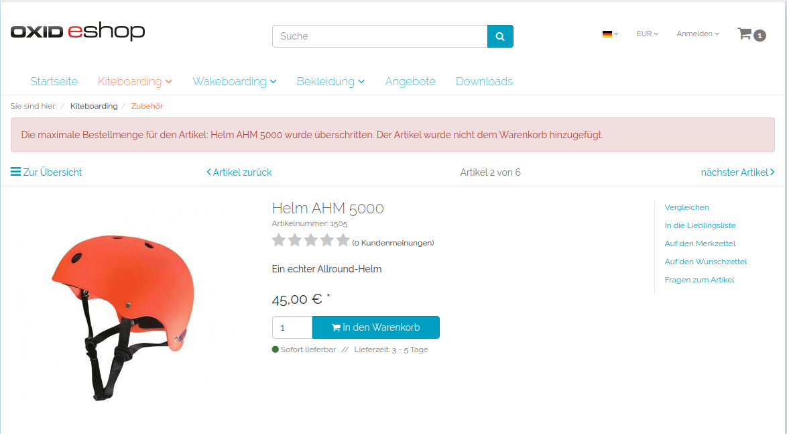

[](https://github.com/patrick-blom/article-limit-per-order)
[](https://packagist.org/packages/patrick-blom/article-limit-per-order)
[](https://packagist.org/packages/patrick-blom/article-limit-per-order)
[](https://github.com/patrick-blom/article-limit-per-order/blob/master/LICENSE)
[](https://twitter.com/pbl0m)

Article Limit Per Order
==================

This module extends the article structure with the maximum order amount of a single article. This amount can not be exceeded per order.

### About the module
Hamster buying is not only a problem in retail stores. Many shops have the problem that people buying articles in a huge amount, especially in days of sale.
To avoid that, this module adds the functionality to add a limit of maximum amounts per order process. With that functionality you can stop people from buying
more items than they should. e.g. Toilette paper. This module was inspired by the COVID-19 problems retailers had, because of people started buying toilette
paper like mad.



### Compatibility

* The module is OXID eShop 6.2 and higher only
* The module was built and will work on the OXID eShop Community Edition
* The module should work on OXID eShop Professional Edition and OXID eShop Enterprise Edition 
* The module was tested on the OXID eShop Community Edition
* The module was **not tested** on OXID eShop Professional Edition and OXID eShop Enterprise Edition 


### Requirements

* OXID eShop 6.2 Community Edition (or higher)
* PHP 7.1 (or higher)

### Module installation via composer

#### Default installation via packagist (recommend)
* add the module to your shop composer.json
    * `cd <shop root>`
    * `composer require patrick-blom/article-limit-per-order`

#### Alternative installation via GitHub (manual)
* create a new folder called "thirdparty" with the subfolder "pb" at the shop root level (same level as the composer.json)
    * `cd <shop root>`
    * `mkdir -p thirdparty/pb`  
* clone the repository to the new folder
    * `git clone git@github.com:patrick-blom/article-limit-per-order.git thirdparty/pb/ArticleLimitPerOrder` 
* navigate back to the shop root level and add the repository to composer.json
    * `composer config repositories.patrick-blom/article-limit-per-order path thirdparty/pb/ArticleLimitPerOrder`
* add the module to your shop composer.json
    * `composer require patrick-blom/article-limit-per-order`    

#### OXID eShop module activation (identical for default && alternative installation)
* prepare the module configuration for eShop 6.2
    * `vendor/bin/oe-console oe:module:install-configuration source/modules/pb/ArticleLimitPerOrder/`
    * `vendor/bin/oe-console oe:module:apply-configuration`
* activate the module
    * `vendor/bin/oe-console oe:module:activate articlelimitperorder`
* regenerate the unified namespace and the views, because the module adds new database fields
    * `vendor/bin/oe-eshop-unified_namespace_generator`
    * `vendor/bin/oe-eshop-db_views_regenerate`
 
### Usage

* After the installation and activation you will find a field called `Maximum amount per order` under:
    * `Administer Products -> Procducts -> [select a Product e.g: 1505] -> Stock (tab)`
* Add the Amount of maximum articles per order (e.g. 2 - for max two of these articles per order) and save the article
* If you want have no limit for the article enter the number 0 to the field and save the article 
   
### Testing

#### !Attention!
The testing process should only be done in a development environment or CI pipeline.

#### Preparing
* Install the module as described
* Prepare the [OXID Testing Library](https://github.com/OXID-eSales/testing_library) likes described in their repository 
or use the [oxvm_eshop](https://github.com/OXID-eSales/oxvm_eshop) / [docker-eshop-sdk](https://github.com/OXID-eSales/docker-eshop-sdk)
* Add `pb/ArticleAlert` to the partial module paths in your test_config.yml (e.g: `partial_module_paths: 'pb/ArticleLimitPerOrder'`)
* Copy the `config.inc.TEST.php.dist` from the vendor module directory to your shop root and rename it to `config.inc.TEST.php`
* Adjust the settings in the `config.inc.TEST.php` to your needs (test database name, error reporting, etc)
* Modify your `config.inc.php` and ensure that the `config.inc.TEST.php` will be loaded during the tests
```php
    // bottom of config.inc.php
    if (defined('OXID_PHP_UNIT')) {
        include "config.inc.TEST.php";
    }
```

#### Run tests
* Navigate to the shop root
* Run the test using the following command: `php vendor/bin/runtests <absolute path to shop root>/source/modules/pb/ArticleLimitPerOrder/Tests`
* Run the coverage using the following command: `php vendor/bin/runtests-coverage <absolute path to shop root>/source/modules/pb/ArticleLimitPerOrder/Tests`

#### Run static analysis
* Install phpstan using `composer require --dev phpstan/phpstan`
* Run the static analysis using the following commands
    * Navigate to the `<shop root>`
    * Run phpstan with  arguments `vendor/bin/phpstan analyze -c source/modules/pb/ArticleLimitPerOrder/phpstan.neon` 

### License
The module is released under GPL-3.0. For a full overview check the [LICENSE](LICENSE) file.
